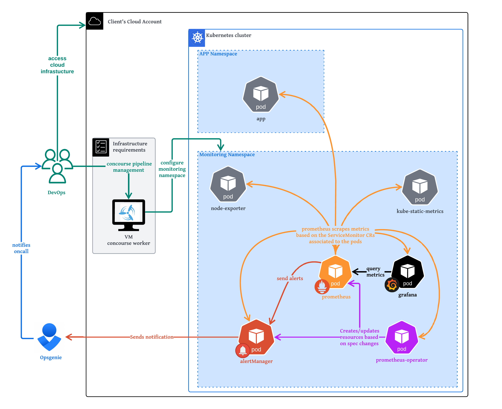

# K8S usecase

In this usecase you can choose to deploy a k8s helm chart named [kube-prometheus-stack](https://github.com/prometheus-community/helm-charts/tree/main/charts/kube-prometheus-stack) that will to deploy the different monitoring tools (prometheus, grafana, alertmanager) and exporters.

The resulting architecture would then be something like this:



## Overview

The stack pipeline is quite easy to understand :

- **terraform plan/apply**: creates all provider resources:
    - **Grafana resources**: configure the grafana sso settings and the dashboard dashboards/folders to use
    - **k8s-prometheus helm chart**: Installs core components of the kube-prometheus stack, a collection of Kubernetes manifests, Grafana dashboards, and Prometheus rules combined with documentation and scripts to provide easy to operate end-to-end Kubernetes cluster monitoring with Prometheus using the Prometheus Operator.
    - **opsgenie heartbeat**: creates a deployment/secret/service to based on [cycloid docker image](https://hub.docker.com/r/cycloid/opsgenie-heartbeat-gw) that provides a gateway between prometheus webhook and Opsgenie heartbeat
    - **prometheus-blackbox-exporter helm chart**: creates a Blackbox-Exporter deployment on a Kubernetes cluster

- **access-view**: displays the information on how to connect to the k8s and all the different URLs and basic auth passwords to use to login in the URL, stored as cycloid credentials

- **grafana-default-dashboards**: updates the configmap with the grafana dashbords to use


## Requirements

Before you can create the project using this usecase of the stack, be sure to have created before:
- **cycloid api-key**: required to create the different cycloid credentials that host the different monitoring access.The API keys needs the following permissions:
  - credential full rigths
  - organization read rigths
- **k8s configfile**: The k8s config file content to be used to connect to the cluster and deploy the different monitoring resources. It should be stored as a cycloid credential
- **Optional cycloid credentials** to create depending on your usecase:
  - **Grafana SSO creds**: when using grafana SSO you'll have to create a cycloid credential containing the Grafana SSO client ID/secret
  - **Grafana datasources**: when you deploy grafana you can add datasources to retrieve other metrics then the default prometheus/alertmanager ones
  - **Opsgenie token**: when you deploy opsgenie heartbeat gateway you need to create a opsgenie token to allow to connect to the opsgenie account
  - **External alertmanager basic auth credential**: if you don't create an alertmanager using the stack you have to connect prometheus to an existing one. For that you should create a cycloid credential containing the basic auth to be used to connect to the external alertmanager.
  - **Alertmanager receivers**: given that recievers contain secret information, if you setup alertmanager you need to create a custom cycloid credential containing an array with the receivers configuration, like you can see bellow. **Note!** Don't forget to always have always a default_empty for the default route to be used
  ```
  - name: 'opsgenie_heartbeat_dynamic_project_env'
  webhook_configs:
    - url: "http://opsgenie-heartbeat-gw.monitoring:5000/dynamic?mapkey='customer;project;env'"
  - name: 'zulip'
    slack_configs:
      - channel: '{{ .CommonLabels.customer }}'
        send_resolved: true
        title: '{{ template "slack.custom.title" . }}'
        text: '{{ template "slack.custom.text" . }}'
        api_url: '$API_URL'
  - name: 'default_empty'
  ```

## How to use

Using the stack is quite easy and simple, you should start by selecting the K8s usecase and then in the forms you have these sections:
- **Cycloid api-key** -> to select the cycloid api-key credential to use
- **K8s config** -> to select the k8s config file and the namespace to use to deploy the different resources
- **Monitoring tools** -> here you select the tools to install on the machine - prometheus, alertmanager and grafana. Enabling each of these results in enabling a stackforms section for the configuration of the tool, as marked bellow as optional sections
- **(Optional) Prometheus** -> section to configure prometheus, more on this on this readme subection bellow on prometheus configuration
- **(Optional) Alertmanager** -> section to configure alertmanager, more on this on this readme subection bellow on alertmanager configuration
- **(Optional) Grafana** -> section to configure grafana, more on this on this readme subection bellow on grafana configuration
- **Blackbox exporter** -> here you select wheter to install the the exporters to install the blackbox exporter, allowing to configure blackbox modules and the prometheus scraping to be used for the exporter
- **Opsgenie** -> here you select to enable the opsgenie gateway and the select the access token to use in the positive case
- **Advanced** -> Allows to change terraform and ansible versions

## Prometheus configuration

To configure prometheus you'll have to specify in the .forms:

1. Start by defining **Prometheus DNS** to be used

Prometheus disable k8s component scraping
Prometheus scraping extra config
Prometheus disable default rules Customize the default rules to disable. For more information about syntax and default rules check the k8s prometheus stack chart default rules
Prometheus default rules customize
Customize the default enabled rules for and severity parameters. For more information about syntax and default rules check the k8s prometheus stack chart default values
Prometheus disable default alerts
Customize the default alerts to disable. For more information about syntax check the k8s prometheus stack here
Prometheus aditional rules
Provide custom rules to be deployed in the cluster. For more information about syntax and default rules check the k8s prometheus stack chart default values
Prometheus Namespace scope
Regex to reduce the namespace scope to which the prometheus rules will apply


2. Then, the **Prometheus scraping config**, this corresponds to the classical prometheus scraping config. **Note!** It should NOT include the blackbox scraping, this will be done on the blackbox exporter section when this exporter is enabled since it has some pre-configured one to help with the target.
3. After, that you'll have to select **default prometheus rules** from the ansible default templates ones to use.
4. Continuing on the rules definition you can then define the different rules value:
  - Then you can configure these rules by configuring the **default label values to use in all rules**
  - You can then configure **default label vaules for specific rules**
  - You can create your own **prometheus rules**
5. Finally you can define the **prometheus data retention time**

## Enabling or changing the default alert rules

TODO

The stack comes configured with a bunch of predefined alerts that can be used.

You can check all available ones in the public stack [here](https://github.com/cycloid-community-catalog/stack-monitoring/tree/master/ansible/templates/default-prometheus-rules).

You can change them directly in the stackforms by changing the files to be used or you can also chose to configure the values that will be applied in all the rules or individually in each rule.

## Avoid scraping uncessary metrics

When scraping metrics using prometheus there's a lot of uncessary default metrics that migth not be useful to you.

You can avoid this by adding a section on the prometheus scraping configuration on stackforms as follows:
```
    metric_relabel_configs:
    # Don't store unwanted metrics
    - source_labels: [__name__]
      action: drop
      regex: go_(.*)
```

## Alertmanager configuration

To configure alertmanager you'll have 2 scenarios:

- **Scenario 1 - not installing Alertmanager on the machine:**
  1. Select the cycloid credential containing the basic auth for acessing an external alertmanager
  2. Provide the list of the externmal alertmanager endpoints to use

- **Scenario 2 - installing Alertmanager on the machine:**
  1. Start by defining **Alertmanager DNS** to be used
  2. Then, the **Alertmanager routes**, this corresponds to the alertmanager routes to use send the different alerts to each recevier. Don't forget to add the default receiver route to send alerts to send all the alerts that don't match no other route rules.
  3. After, that you'll have to can specify **alertmanager inhibition rules** to list the inhibition rules to mute existing alerts
  5. Finally you can select the cycloid credential containing the **alertmanager receivers**

### Create simple alertmanager GMAIL receiver

To quickly test an alertmanager configuration you can create a receiver to send emails directly from alertmanager to gmail.

Here's a [quick tutorial link](https://grafana.com/blog/2020/02/25/step-by-step-guide-to-setting-up-prometheus-alertmanager-with-slack-pagerduty-and-gmail/) on the grafana official blog on how to do this and retrieve the different required accesses

The reciever should looks something like this:
```
widget: text_area
type: array
default:
  - name: 'default'
    email_configs:
    - to: 'test@example.com'  # Placeholder email address for testing
      from: 'alertmanager@example.com'  # Sender email (can be a dummy address)
      smarthost: 'localhost:25'
      send_resolved: true  # Send notifications for resolved alerts

  - to: $GMAIL_ACCOUNT
    from: $GMAIL_ACCOUNT
    smarthost: smtp.gmail.com:587
    auth_username: "$GMAIL_ACCOUNT"
    auth_identity: "$GMAIL_ACCOUNT"
    auth_password: "$GMAIL_AUTH_TOKEN"
```

## Grafana configuration

To configure grafana you'll have to specify in the .forms:

1. Start by defining **Grafana DNS** to be used
2. Then, the **Grafana dashboard IDs**, this is corresponds to a list of dashboards which should be imported by ID, available publicly at grafana.
3. Finally if you wish to use **custom dashboards**, you can either upload them to grafana community or import them using a json file by uploading them on the project config git repository.

**Note!** The default cycloid dashboards are always imported you can find them at `grafana-dashboards`.

### Adding public grafana dashboard

The community dahsboards can be added simply via the stackforms in the grafana section by defining the public dashboard id, the revision id and using the prometheus as datasource, as you can see bellow.
```
... in stackforms parameter for public dashboards
- dashboard_id: 13659
  datasource: prometheus
  revision_id: 1
```

### Adding private grafana dashboard

For private dashboard you have to import the json file.

To do that you'll need to upload the json file of the dashboard in the repository config of the project as follows:
```
\$GIT-CONFIG-REPO
  \terraform
    \grafana-dashboards
      \FOLDER_1
        $GRAFANA_DASHBOARD_1.json <--
        ...
```
Once you added you'll have to relaunch the deploy job.

## Troubleshoot/tips

## Service not working

Even if the deploy job has successul status on the pipeline, the service migth still fail after, to verify that just connect to the machine and check the service status and logs:
```
# config at /etc/prometheus
systemctl status prometheus
journalctl -u prometheus
```

**TIP** You can use tools like [promtool](https://prometheus.io/docs/prometheus/latest/command-line/promtool/) to help validate configurations and have more inputs

**TIP** Sometimes the issue is a simple identation issue, that should be easy to identify on the logs and checking the different service files at /etc/$SERVICE

## Using no public IP

When you don't set publicIP you'll need to do port redirect to connect to the different tools web interface from your local browser.
For that you should do:
1. Add an entry in your local host file, as follows
```
/etc/hosts
...
127.0.0.1 prometheus.test.fr -> this should be the DNS defined on the stackforms during the project setup
```
2. From a local console launch the port forward using SSM, selecting the correct port associated to the tools, as follows
```
$ aws ssm start-session --target $INSTANCE_ID --document-name AWS-StartPortForwardingSession --parameters '{"portNumber":["9090"],"localPortNumber":["9090"]}' -> This for prometheus usecase, for alertmanager would be 9093 and grafana 3000

```
3. Connect from your browser like so `prometheus.test.fr:9090`

## Create grafana alerts

1. create crednetial containing the information related to the datasource
2. create the different grafana alerts directly on grafana, don't forget to save them


## Errors when deploying twice in the same cluster

Beware that when deploying the stack 2 times in the same cluster you will have issues related to the 2 prometheus-operator killing each other

## Gmail Setup SSO in grafana

To this you can just follow the tutorial of [grafana offical pages](https://grafana.com/docs/grafana/latest/setup-grafana/configure-security/configure-authentication/google/#configure-google-oauth2-authentication)

## Datasource prometheus scaleway

Here's some important links related to this:
- [create token to be used to connect](https://www.scaleway.com/en/docs/cockpit/how-to/create-token/)
- [how to connect grafana](https://www.scaleway.com/en/docs/tutorials/using-own-grafana/)

## Change path of imported dashboards

You cannot save imported datasource dashboard to another folder so you have to manually save it as copy somewhere else.Issue on this [here](https://github.com/grafana/grafana/issues/10183)
