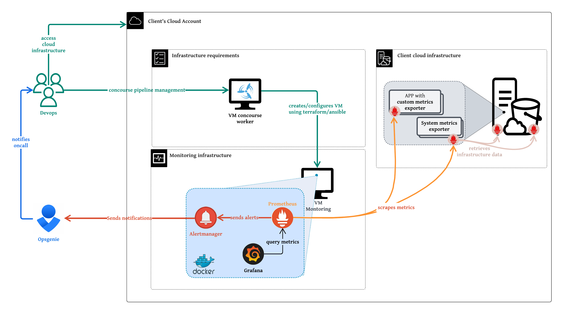

# VM AWS usecase

In this usecase you can choose to deploy a VM that will contain a service for each of the tools you choose to install that is prometheus, alertmanager and grafana.

The VM is configured using ansible and it's mainly based on the following ansible collections:

- **prometheus collection**: It's used to installed prometheus and grafana as well as the different exporters to get the different metrics of the monitoring machine. The official docs are available [here](https://prometheus-community.github.io/ansible/branch/main/).

- **grafana collection**: It's used to installed grafana. The official docs are available [here](https://docs.ansible.com/ansible/latest/collections/grafana/grafana/index.html).

The resulting architecture would then be something like this:



## Overview

The stack pipeline is quite easy to understand :

- **terraform plan/apply**: creates all provider resources:
    - **VM**: inside chosen VPC/subnet, with default Debian 12, but possible to select another AMI
    - **IAM policy/role**: Creates all the IAM resources required for the VM to access AWS services configurable and to use SSM, you can add extra IAM policies to be give extra rigths to the instance
    - **Security groups**: Creates the following rules allow ingress : 80/443, 22(optionally) and 9100 (to monitor own machine)
   - **Cycloid credentials**: Creates the different cycloid credentials as required holding the instance SSH key and the basic auth to access each tool
    - **S3 SSM bucket**: used for communication of ansible and the instances using SSM, based on the aws_ssm_conection ansible module [docs](https://docs.ansible.com/ansible/latest/collections/community/aws/aws_ssm_connection.html)
    - **Cloudwatch alarm**: to allow to recover the EC2 prometheus instance, if status check failed twice during 60 seconds
    - **Elastic IP**: (Optional) allows to create a public IP to be associated to the instance
    - **Route53 records**: (Optional) allows to create the route53 records on the specified route53 zone for the tools to use.
    - **SSH key**: (Optional) creates the ssh key to be used to connect to the instance using ssh

- **deploy**: configures the VM with ansible installing all the different tools inside. The ansible code is organized as follows:
    ```
    /environnments
      defaults.yml -> contains all the default config for the role
      stackforms.sample.yml -> the file that will be used as a template and filled by stackforms with the configured vars
    /files/alertmanager
      default.tmpl -> default template used in alertmanager to proper configured how the alert will be show
    /templates
      /default-prometheus-rules/ -> contains all the different pre-defined ready to use alert rules
      organization.rules -> template file to be used to create custom rules using stackforms config
    main.yml -> main playbook with different tags per provider (only AWS supported so far)
    requirements.yml -> contains all the required roles/collections of ansible to use
    vm-setup.yml -> common playbook to be used by all providers
    ```

- **access-view**: displays the information on how to connect to the machine and all the different URLs and basic auth passwords to use to login in the URL, stored as cycloid credentials

## Requirements

Before you can create the project using this usecase of the stack, be sure to have created before:
- **cycloid api-key**: required to create the different cycloid credentials that host the different monitoring access.The API keys needs the following permissions:
  - credential full rigths
  - organization read rigths
- **AWS credentials**: you need to create a cycloid aws credential to be used to create the different resources
- **VPC and Subnet**: these need to be created before creating the VM since the stack doesn't handle these resources creation, since you cannot create credentials directly on stackforms
- **Optional cycloid credentials** to create depending on your usecase:
  - **External alertmanager basic auth credential**: if you don't create an alertmanager using the stack you have to connect prometheus to an existing one. For that you should create a cycloid credential containing the basic auth to be used to connect to the external alertmanager.
  - **Alertmanager receivers**: given that recievers contain secret information, if you setup alertmanager you need to create a custom cycloid credential containing an array with the receivers configuration, like you can see bellow. **Note!** Don't forget to always have always a default_empty for the default route to be used
  ```
  - name: 'opsgenie_heartbeat_dynamic_project_env'
  webhook_configs:
    - url: "http://opsgenie-heartbeat-gw.monitoring:5000/dynamic?mapkey='customer;project;env'"
  - name: 'zulip'
    slack_configs:
      - channel: '{{ .CommonLabels.customer }}'
        send_resolved: true
        title: '{{ template "slack.custom.title" . }}'
        text: '{{ template "slack.custom.text" . }}'
        api_url: '$API_URL'
  - name: 'default_empty'
  ```

## How to use

Using the stack is quite easy and simple, you should start by selecting the VM usecase and then in the forms you have these sections:
- **Cycloid api-key** -> to select the cycloid api-key credential to use
- **AWS credentials** -> to select the cycloid aws credential to use and the aws region as well
- **VM configuration** -> where you will specify everything related to the machine configuration, that is size, create dns etc
- **Monitoring tools** -> here you select the tools to install on the machine - prometheus, alertmanager and grafana. Enabling each of these results in enabling a stackforms section for the configuration of the tool, as marked bellow as optional sections
- **(Optional) Prometheus** -> section to configure prometheus, more on this on this readme subection bellow on prometheus configuration
- **(Optional) Alertmanager** -> section to configure alertmanager, more on this on this readme subection bellow on alertmanager configuration
- **(Optional) Grafana** -> section to configure grafana, more on this on this readme subection bellow on grafana configuration
- **Exporters** -> here you select the exporters to install on the machine - blackbox exporter, mysql exporter, postgres exporter, node exporter. Enabling each of these results in enabling a stackforms section for the configuration of the exporter, as marked bellow as optional sections, excpect for node-exporter that will just result in installing node-exporter on the monitoring machine
- **(Optional) Blackbox exporter** -> allows to configure blackbox modules and the prometheus scraping to be used for the exporter
- **(Optional) MySQL exporter** -> allows to specify the data to access the mysql database to monitor
- **(Optional) Postgres exporter** -> allows to specify the data to access the postgresql database to monitor
- **Advanced** -> Allows to change terraform and ansible versions

## Prometheus configuration

To configure prometheus you'll have to specify in the .forms:

1. Start by defining **Prometheus DNS** to be used
2. Then, the **Prometheus scraping config**, this corresponds to the classical prometheus scraping config. **Note!** It should NOT inbclude the blackbox scraping, this will be done on the blackbox exporter section when this exporter is enabled since it has some pre-configured one to help with the target.
3. After, that you'll have to select **default prometheus rules** from the ansible default templates ones to use.
4. Continuing on the rules definition you can then define the different rules value:
  - Then you can configure these rules by configuring the **default label values to use in all rules**
  - You can then configure **default label vaules for specific rules**
  - You can create your own **prometheus rules**
5. Finally you can define the **prometheus data retention time**

## Enabling or changing the default alert rules

The stack comes configured with a bunch of predefined alerts that can be used.

You can check all available ones in the public stack [here](https://github.com/cycloid-community-catalog/stack-monitoring/tree/master/ansible/templates/default-prometheus-rules).

You can change them directly in the stackforms by changing the files to be used or you can also chose to configure the values that will be applied in all the rules or individually in each rule.

## Creating custom alert rules

You can define custom prometheus alert rules that will be saved at templates/rules/$organization.rules file directly within stackforms.

You'll find on the stackforms description more information about syntax and tips to do this.

## Avoid scraping uncessary metrics

When scraping metrics using prometheus there's a lot of uncessary default metrics that migth not be useful to you.

You can avoid this by adding a section on the prometheus scraping configuration on stackforms as follows:
```
    metric_relabel_configs:
    # Don't store unwanted metrics
    - source_labels: [__name__]
      action: drop
      regex: go_(.*)
```


## Add extra scraping in AWS VMs

To enable the scraping of other machines using in AWS you'll have to create security groups to allow the VM machine to reach the different required ports for each exporter.

You can then do this by adding a new file inside the git config repository under the terraform folder as follows:

```
\$GIT-CONFIG-REPO
  \terraform
    sg_extra_scraping.tf <-- file to create
```
The file should contain the code to create the required sgs in each of the VPCs that you wish to monitor, as follows:

```
resource "aws_security_group" "$SG_NAME" {
  name        = "$SG_NAME"
  description = "Allow prometheus server to scrape metrics"
  vpc_id      = $VPC_ID

  # Add the required ports to scrape, here is node-exporter only that is enabled
  ingress {
    from_port       = 9100
    to_port         = 9100
    protocol        = "tcp"
    security_groups = [module.prometheus.prometheus_secgroup_id]
    self            = false
  }

  egress {
    from_port   = 0
    to_port     = 0
    protocol    = "-1"
    cidr_blocks = ["0.0.0.0/0"]
  }

  tags = {
    Name         = "$NAME$"
    organization = "${var.organization}"
    project      = "${var.project}"
    env          = "${var.env}"
    component    = "${var.component}"
    "cycloid.io" = "true"
  }
}

output "$SG_NAME" {
  value = aws_security_group.$SG_NAME.id
}

```
Once you have done this, trigger the terraform plan/apply jobs on the pipeline and this will create these sgs on the aws account

Then what you need to do is to attach the sgs to the different instances that you wish to monitor and you're all set


### Locally test changes in the template rule files

To quickly test changes in the prometheus template rule files you can just create a local playbook to test the playbooks default prometheus rules.

For that you should create a local file like `/ansible/test.yml` and copy this inside:

```
- name: Render and validate configuration file
  hosts: localhost
  vars_files:
    - "environments/defaults.yml"
    - ["environments/stackforms.yml","environments/stackforms.sample.yml"]
  tasks:
    - name: Render a configuration file
      template:
        src: templates/default-prometheus-rules/$RULE_TO_TEST
        dest: /tmp/$RULE_TO_TEST
```

Then create the testing config to test `/ansible/stackforms.yml` and copy this inside:
```
# the rules to test for example
prometheus_default_rules_custom:
  ElasticsearchIsDown:
    disable: false
    organization: "org1"
    project: "proj1"
    env: "env1"
    component: "component1"

# this is required since the vars are set on the concourse pipeline and have no default value
organization: "organization"
project: "project"
env: "env"
component: "component"
```
Then launch `ansible-playbook test.yaml` to test the configuration

## Alertmanager configuration

To configure alertmanager you'll have 2 scenarios:

- **Scenario 1 - not installing Alertmanager on the machine:**
  1. Select the cycloid credential containing the basic auth for acessing an external alertmanager
  2. Provide the list of the externmal alertmanager endpoints to use

- **Scenario 2 - installing Alertmanager on the machine:**
  1. Start by defining **Alertmanager DNS** to be used
  2. Then, the **Alertmanager routes**, this corresponds to the alertmanager routes to use send the different alerts to each recevier. Don't forget to add the default receiver route to send alerts to send all the alerts that don't match no other route rules.
  3. After, that you'll have to can specify **alertmanager inhibition rules** to list the inhibition rules to mute existing alerts
  5. Finally you can select the cycloid credential containing the **alertmanager receivers**

### Create simple alertmanager GMAIL receiver

To quickly test an alertmanager configuration you can create a receiver to send emails directly from alertmanager to gmail.

Here's a [quick tutorial link](https://grafana.com/blog/2020/02/25/step-by-step-guide-to-setting-up-prometheus-alertmanager-with-slack-pagerduty-and-gmail/) on the grafana official blog on how to do this and retrieve the different required accesses

The reciever should looks something like this:
```
widget: text_area
type: array
default:
  - name: 'default'
    email_configs:
    - to: 'test@example.com'  # Placeholder email address for testing
      from: 'alertmanager@example.com'  # Sender email (can be a dummy address)
      smarthost: 'localhost:25'
      send_resolved: true  # Send notifications for resolved alerts

  - to: $GMAIL_ACCOUNT
    from: $GMAIL_ACCOUNT
    smarthost: smtp.gmail.com:587
    auth_username: "$GMAIL_ACCOUNT"
    auth_identity: "$GMAIL_ACCOUNT"
    auth_password: "$GMAIL_AUTH_TOKEN"
```

## Grafana configuration

To configure grafana you'll have to specify in the .forms:

1. Start by defining **Grafana DNS** to be used
2. Then, the **Grafana dashboard IDs**, this is corresponds to a list of dashboards which should be imported by ID, available publicly at grafana.
3. Finally if you wish to use **custom dashboards**, you can either upload them to grafana community or import them using a json file by uploading them on the project config git repository.

**Note!** The default cycloid dashboards are always imported you can find them at `grafana-dashboards`.

### Adding public grafana dashboard

The community dahsboards can be added simply via the stackforms in the grafana section by defining the public dashboard id, the revision id and using the prometheus as datasource, as you can see bellow.
```
... in stackforms parameter for public dashboards
- dashboard_id: 13659
  datasource: prometheus
  revision_id: 1
```

### Adding private grafana dashboard

For private dashboard you have to import the json file.

To do that you'll need to upload the json file of the dashboard in the repository config of the project as follows:
```
\$GIT-CONFIG-REPO
  \ansible
    \files
      \grafana
        $GRAFANA_DASHBOARD_1.json <--
        ...
```
Once you added you'll have to relaunch the deploy job.

## Troubleshoot/tips

### How to connect to machine

How to connect with machine:
- **using ssm agent**: installed by default on the machine `aws ssm start-session --target $INSTANCE_ID$`_
- **using ssh**: if you haven enabled the ssh access on the machine using `ssh -i ssh_key_created admin@$VM_PUBLIC_IP`. Make sure that your local station has SSH access to the monitoring machine

## Service not working

Even if the deploy job has successul status on the pipeline, the service migth still fail after, to verify that just connect to the machine and check the service status and logs:
```
# config at /etc/prometheus
systemctl status prometheus
journalctl -u prometheus
```

**TIP** You can use tools like [promtool](https://prometheus.io/docs/prometheus/latest/command-line/promtool/) to help validate configurations and have more inputs

**TIP** Sometimes the issue is a simple identation issue, that should be easy to identify on the logs and checking the different service files at /etc/$SERVICE

## Using no public IP

When you don't set publicIP you'll need to do port redirect to connect to the different tools web interface from your local browser.
For that you should do:
1. Add an entry in your local host file, as follows
```
/etc/hosts
...
127.0.0.1 prometheus.test.fr -> this should be the DNS defined on the stackforms during the project setup
```
2. From a local console launch the port forward using SSM, selecting the correct port associated to the tools, as follows
```
$ aws ssm start-session --target $INSTANCE_ID --document-name AWS-StartPortForwardingSession --parameters '{"portNumber":["9090"],"localPortNumber":["9090"]}' -> This for prometheus usecase, for alertmanager would be 9093 and grafana 3000

```
3. Connect from your browser like so `prometheus.test.fr:9090`

## Enable TLS

You can enable HTTPs on the different DNS for each of the tools.

To enable this on the **VM configuration section** of the stackforms select enable HTTPs.

This will open a subsection where you can chose to either import a certificate or let the stack create a self-signed one.

The files are upload on the machin in the folder `/etc/nginx/ssl` with the names `tls.crt & tls.key`
